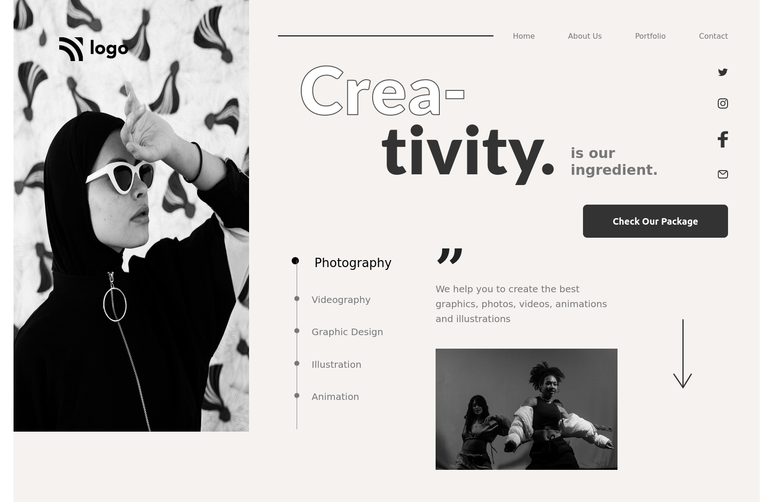
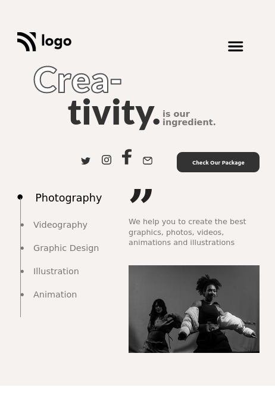

# PROJECT 14 - CREATIVITY

This is the 14th html and css responsive project among the 15 Ineuron-projects.

## Table of contents

- [Overview](#overview)
  - [Screenshot](#screenshot)
  - [Links](#links)
- [My process](#my-process)
  - [Built with](#built-with)
  - [Time required](#time-required)
  - [What I learned](#continues-development)
  - [Useful resources](#useful-resources)
- [Author](#author)
- [Acknowledgments](#acknowledgments)

## Overview

### Screenshot





### Links

- Code File URL: [github.com](https://github.com/Jyotimoykathar/Project-02)
- Live Site URL: [netlify.app](https://project-02-restaurant.netlify.app/)

## My process

### Built with

- Semantic HTML5 markup
- CSS custom properties
- Flexbox Css
- Css Grid

### Time required

Nearly 5 day required to set the idea and get the desired position of the image, all different sections and reponsivness was time consuming.

### What I learned

This is the css design code snippet of the navbar class of Restaurant project. I learned that with grid it was easy to beautifuly placed our sections.

```css
.grid {
  display: grid;
  column-gap: 4.2rem;
  row-gap: 9.6rem;
}
.grid--2-cols {
  grid-template-columns: repeat(2, 1fr);
}
.grid--3-cols {
  grid-template-columns: repeat(3, 1fr);
}
.grid--4-cols {
  grid-template-columns: repeat(4, 1fr);
}
.right-section {
  grid-column: 2/4;
  padding: 6.4rem 2rem;
  margin-right: 4.8rem;
}
```

### Continued development

I still have a lot to learn about flexbox and grid. Which will be later implemented to the website with better responsivness and with animations.

### Useful resources

- [MDN](https://developer.mozilla.org/en-US/) - This website helped me to any thing i had to look upon.
- [IONICONS](https://ionic.io/ionicons) - This websit provided me with free icons, which were very easy to implement.

## Author

- Github page- [Jyotimoykathar](https://github.com/Jyotimoykathar/)

## Acknowledgments

Special Thanks to Ineuron team for the html and css responsive project to test and improve my CSS grid and media query skills.
